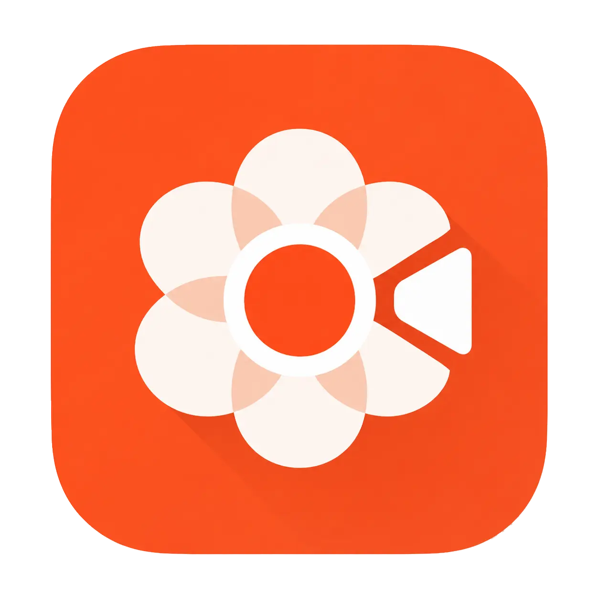

<div align="center">
  
  
  # DemoRecorder

  **Undeniably the fastest way to record a video into a high-fidelity demo.**

  [](https://vuejs.org/)
  [](https://github.com/mediabunny)
  [](https://vitest.dev/)
  [](https://microsoft.com)
  [](https://apple.com)
  [](https://kernel.org)

  <p align="center">
    <a href="#key-features">Key Features</a> •
    <a href="#presentation">Presentation</a> •
    <a href="#getting-started">Getting Started</a> •
    <a href="#developers">Developer Guide</a> •
    <a href="#os-support">OS Support</a>
  </p>
</div>

---

## ⚡ Built for Absolute Speed & Reliability

DemoRecorder is engineered from the ground up for peak performance. By separating concerns between user experience and low-level processing:
- **Rust Core Engine**: Handles low-level multi-track capture, audio mixing, and frame pipelines with zero-cost abstractions, maximum safety, and raw performance.
- **Vue.js + Electron Client**: Provides a modern, responsive, and minimalist interface with lightweight rendering.

This architecture ensures that your recording workflow is incredibly lightweight, frame-perfect, and bulletproof.

---

## 🎬 Presentation

<div align="center">
  <h3>Demo Video</h3>
  <!-- Replace the src with your actual presentation video link -->
  <video src="https://user-images.githubusercontent.com/placeholder-video.mp4" width="100%" controls poster="./public/brand/DemoRecorderIcon.webp">
    Your browser does not support the video tag.
  </video>
  
  <br/>
  
  <h3>Product Screenshot</h3>
  <!-- Replace with actual application screenshot -->
  
</div>

---

## 🚀 Key Features

- **Multi-track Recording**: Capture system audio, microphone, webcam, and screen streams onto isolated tracks.
- **Spring-Animated Zooms**: Auto-generates zoom animations based on your cursor path for professional, high-fidelity focus.
- **Sleek Dark Theme**: Minimalist dark-gray palette tailored for creators.
- **Instant Export**: Export and package capture sessions directly.

---

## 💻 OS Support

- **Windows**: Supported out of the box (requires Windows 10/11).
- **macOS**: Supported out of the box (Intel & Apple Silicon).
- **Linux**: Supported. System-audio rendering requires the native ALSA development headers and `pkg-config`:
  ```bash
  sudo apt update
  sudo apt install -y libasound2-dev pkg-config
  ```

---

## 🛠️ Getting Started

To run the application locally:

```bash
# Install node dependencies
npm install

# Compile the native Rust capture engine
npm run capture:build-dev

# Start the dev environment (Vite & Electron)
npm run dev:all
```

---

## 🧑‍💻 Developers

If you are looking to contribute, run tests, or compile production builds, please head over to the developer documentation:

👉 **[Developer Setup & Testing Guide](file:///c:/Users/binos/Documents/Personal_project/OSS/DemoRecorder/demo-recorder/demo-recorder/docs/dev/developper.md)**

This document explains our **90% test coverage gate** (Vitest/Cargo), clippy formatting standards, build processes, and architecture rules.
