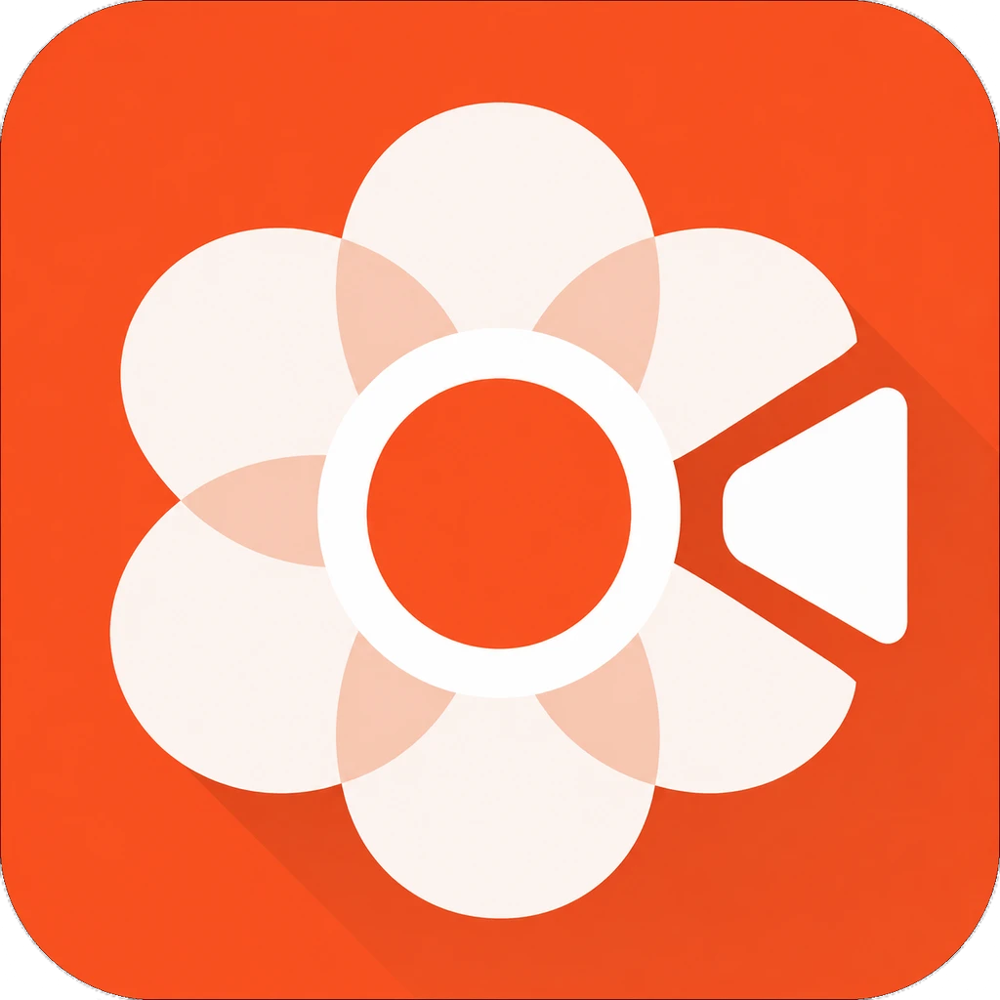

  
  <h1>Beam</h1>
  
Record your screen. Focus what matters. Export.

  

    <a href="https://github.com/ExtraBinoss/demo-recorder/releases/latest">Download for Windows or macOS</a>
  

  <!-- Replace this source with the product demo before publishing the README. -->
  <video controls width="100%" poster="./public/brand/BeamIcon.webp">
    <source src="YOUR_DEMO_VIDEO_URL_HERE" type="video/mp4" />
    Your browser does not support video playback.
  </video>

<h2>Workflow</h2>

  <strong>Record your screen</strong>
  &nbsp;→&nbsp;
  <strong>Zoom applied automatically</strong>
  &nbsp;→&nbsp;
  <strong>Export</strong>

<h2>What you can record</h2>

<ul>
  <li>Choose a window or an entire screen.</li>
  <li>Capture the cursor or use a custom cursor.</li>
  <li>Record system audio.</li>
  <li>Record a microphone.</li>
  <li>Export quickly.</li>
</ul>

<h2>Supported platforms</h2>

<ul>
  <li><strong>Windows</strong></li>
  <li><strong>macOS</strong></li>
  <li><strong>Linux:</strong> not supported yet. Reliable screen recording differs substantially across Linux environments. See <a href="./docs/linux/ELECTRON_FALLBACK_LINUX.md">the fallback notes</a> and <a href="./docs/linux/FUTURE_LINUX_RECORDING.md">the recording plan</a>.</li>
</ul>

<h2>Developer docs</h2>

  <a href="./docs/dev/windows.md">Windows</a>
  &nbsp;·&nbsp;
  <a href="./docs/dev/mac.md">macOS</a>
  &nbsp;·&nbsp;
  <a href="./docs/dev/linux.md">Linux</a>

<h2>Special thanks</h2>

  Beam takes inspiration from <a href="https://github.com/webadderallorg/Recordly/">Recordly</a>. Some code ideas are inspired by it; Beam is not a fork.

  Released under the <a href="./LICENSE">MIT License</a>.

