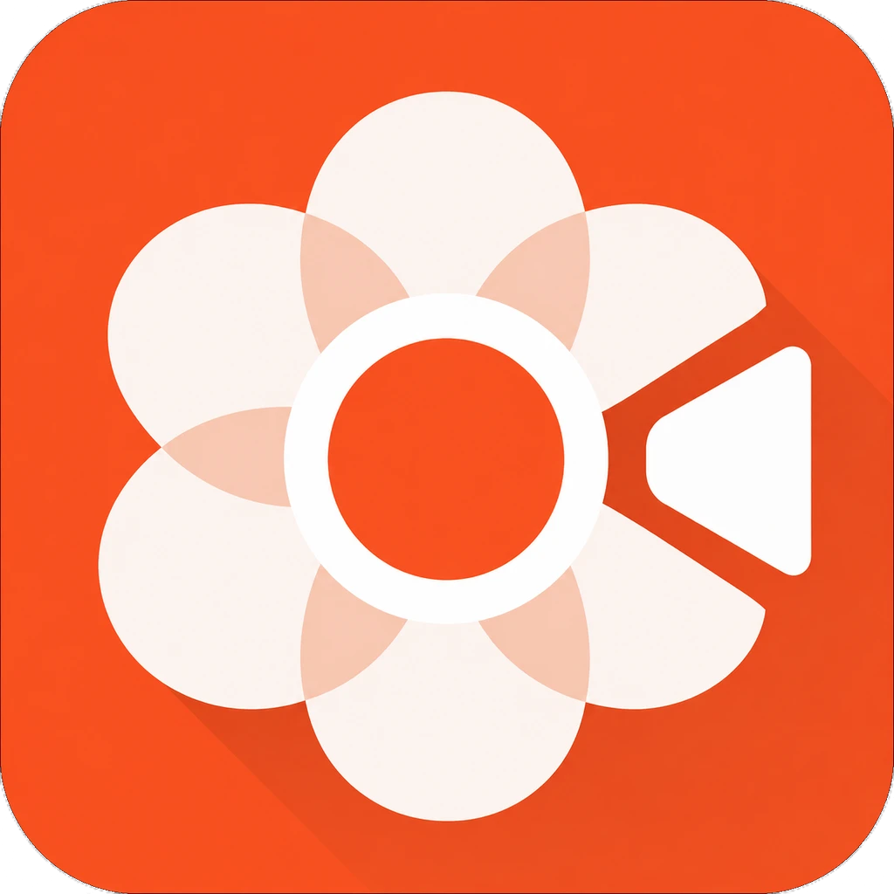

<div align="center">
  
  <h1>Beam</h1>
  <p>A Screen Recorder for clear, polished product demo, similar to Recordly or ScreenStudio.</p>
  <p>
    <a href="https://github.com/BeamRecorder/Beam/releases/latest">Download Beam for Windows, macOS, or Linux</a>
    ·
    <a href="https://discord.gg/6Q6v2xUCB"> Join Beam on Discord</a>
  </p>
</div>

## 🎥 Demo

[BeamDemo.webm](https://github.com/user-attachments/assets/8fb3851c-eccd-4c1a-94b8-3c4d6e0250b9)

## 📸 Screenshots


# 🚀 Features

## Capture

- 🖥️ **Display, Window, or Custom Crop**
  Record your full screen, a specific app window, or select any area you want to capture.
- 🎙️ **Separate Audio Tracks**
  Capture your microphone and system audio at the same time, each on its own track for easier editing.
- 🎥 **Webcam Overlay**
  Add your camera on top of the recording, move it anywhere on screen, and customize its size and shape.
- 📖 **Floating Teleprompter**
  Keep your script visible while recording with a lightweight transparent teleprompter that stays out of the final capture.

## Editing & Styling

- 🔍 **Smart Zooms**
  Automatically zoom in around clicks and keyboard actions, or add your own zooms with keyframes.
- 🖱️ **Cursor Smoothing & Styling**
  Get clean, fluid cursor movement with native high-precision tracking. Adjust the size, swap the cursor style, add click effects, or smooth out shaky movement.
- 📝 **Local AI Captions**
  Generate subtitles directly on your device using Whisper. No cloud uploads, API keys, or extra subscriptions.
- 🎨 **Canvas Backdrops**
  Give your recordings a polished look with backgrounds, gradients, padding, shadows, and rounded window corners.
- ⏱️ **Multi-Track Timeline**
  Edit video, audio, and subtitles independently with precise scrubbing, snapping, and non-destructive editing.

## Performance & Export

- 🦀 **Rust Capture Engine**
  A lightweight native capture engine built for smooth 60 fps recording without putting unnecessary load on your CPU or GPU.
- 📦 **Direct Export**
  Export straight to MP4 or WebM, up to 4K, with simple bitrate presets and fast rendering.

See [GPU drivers and WebCodecs export](docs/dev/gpu-drivers.md) for hardware prerequisites, installation guidance and verified platform limits.

Have ideas or feature requests? Open an issue or join the discussion on [Discord](https://discord.gg/6Q6v2xUCB).

## 🌍 Availability

Beam is available for Windows, macOS, and Linux.

<details>
<summary><strong>🪟 Windows</strong></summary>

- Distributed as a native Windows installer.
- Screen, window, region, camera, microphone, and system-audio recording are supported.
- Overlay positions and sizes can be saved and restored.

</details>

<details>
<summary><strong>🍏 macOS</strong></summary>

- Distributed as a DMG for Apple Silicon Macs running macOS 13 or newer.
- Screen Recording, Microphone, and Camera permissions must be granted when those sources are used.
- Overlay positions and sizes can be saved and restored.

> [!NOTE]
> **"Beam is damaged and cannot be opened"**
>
> After moving Beam into `/Applications`, remove the macOS quarantine flag in Terminal:
>
> ```bash
> xattr -cr /Applications/Beam.app
> ```
>
> Alternatively, go to **System Settings > Privacy & Security**, scroll to **Security**, and click **Open Anyway**.

</details>

<details>
<summary><strong>🐧 Linux</strong></summary>

- Distributed as AppImage, DEB, and RPM packages.
- Screen and window capture uses XDG Desktop Portal, PipeWire, and FFmpeg. The system picker requests explicit permission when a capture starts.
- Recording click and keyboard-shortcut metadata requires explicit Polkit consent.
- On X11, overlay positions and sizes can be saved and restored.
- On native Wayland, overlay sizes can be saved, but positions cannot. Wayland prevents applications from reading global window coordinates, so Electron reports `x: 0, y: 0` and Beam cannot restore the camera overlay or teleprompter position.
- Beam does not force XWayland as a workaround because it can be incompatible with some GPU and X11 configurations.

</details>

## 🌐 Supported Languages

The interface is available in 15 languages:

- 🇺🇸 English
- 🇫🇷 Français
- 🇪🇸 Español
- 🇩🇪 Deutsch
- 🇷🇺 Русский
- 🇧🇬 Български
- 🇨🇳 简体中文
- 🇰🇷 한국어
- 🇧🇷 Português (Brasil)
- 🇯🇵 日本語
- 🇮🇹 Italiano
- 🇵🇱 Polski
- 🇹🇼 繁體中文
- 🇮🇳 हिन्दी
- 🇻🇳 Tiếng Việt

## 🛠️ Developer documentation

Run `bun run dev` to start Vite and Electron in one terminal. Each worktree gets its own persistent development session and an available renderer port. All sessions reuse your existing projects, screenshots and preferences in `Videos/Beam/user/`. Use `bun run dev --session preview` for another isolated Electron profile in the same worktree, or `bun run dev --force-no-rust` to use the verified prebuilt capture engine. `Ctrl+C` stops the session.

If you want to run Beam locally or contribute to the project, start with the guide for your platform:

- 📖 [Contributing Guide](./docs/dev/CONTRIBUTING.md)
- 🪟 [Windows development](./docs/dev/windows.md)
- 🍏 [macOS development](./docs/dev/mac.md)
- 🐧 [Linux development](./docs/dev/linux.md)

The repository's engineering guidelines are linked from each guide.

Beam's framework-independent engine provides the same document commands, immutable history and identified JSON transactions to application code, CLI tools and agent adapters. See the [shared authoring protocol](./docs/architecture/authoring-protocol.md) and [architecture](./docs/ARCHITECTURE.md).

The packaged application includes `beam-cli` (`beam-cli.cmd` on Windows); Linux also accepts `beam --cli`. In development, use `bun run beam`. Commands support creating video/image documents, editing, JSON-lines transactions, native capture, frame extraction, HTML/Vue motion and MP4/WebM/PNG/WebP export. Codecs and GPU rendering use an explicit Chromium backend; install it with `beam-cli browser install` or configure `BEAM_CHROMIUM_EXECUTABLE`.

Video export accepts `beam-cli export request.json output.mp4 --backend webcodecs` (default), or `--backend ffmpeg-vaapi` for experimental Linux GPU export. Both use Beam's common renderer. FFmpeg requires a working X11/XWayland display, VA-API drivers and built native artifacts; see [setup and CLI usage](./docs/dev/ffmpeg-gpu-export.md).

## 💬 Join the Beam community

Have feedback, ideas, or questions? Join the Beam community on Discord and follow the project on GitHub.

<p>
  <a href="https://discord.gg/6Q6v2xUCB"> Join Beam on Discord</a>
  ·
  <a href="https://github.com/BeamRecorder/Beam"> Beam on GitHub</a>
</p>

## 💖 Acknowledgements

Beam takes inspiration from [Recordly](https://github.com/webadderallorg/Recordly/). Some ideas are inspired by it; Beam is not a fork, it is a complete rewrite.

Beam's source code is released under [MPL-2.0](./LICENSE). See
[Beam licensing](./LICENSING.md) for commercial use, forks, third-party material
and earlier MIT versions. The planned [Desktop Pro policy](./docs/licensing/DESKTOP-PRO.md)
covers subscriptions and future paid features and cloud services; it does not
introduce an activation system or change current Free features.
