Video editor.

A lot is going to be seen here, for an AI agent, split it accordingly according to different catagories.

Interface :

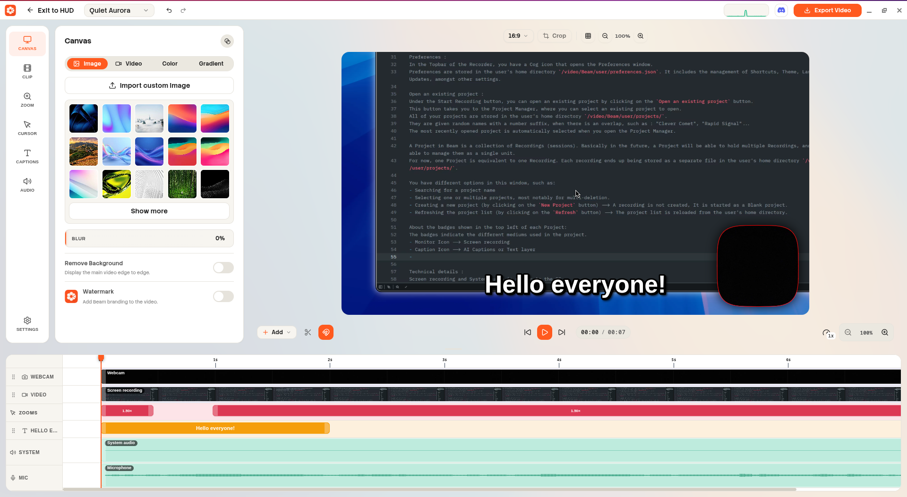

The default interface is shown above.

In the topbar, you have different options:
- Exit to HUD, takes you back to the Recorder app.
- Selector with the Project name --> Change project anytime you want.
- Undo/Redo, every action is undoable/redoable. Up to 10 actions can be undone/redone, it is saved in the project file. So you can undo/redo 10 times before it is lost, even after re-opening the project.
- Performance monitor --> Shows current state of the performance for the application, Green means OK, Orange means warning, Red means critical.
- Discord button --> Join our discord! https://discord.gg/6Q6v2xUCB
- Export --> Export the current project as a video file.
- Minimize/Maximize/Close --> Minimize the window, maximize the window, or close the window.

On your left side you have two things:
- Sidebar : "Canvas", "Clip", "Zooms", "Cursor", "Captions", "Settings", these might evolve in the future.
- Properties panel : This is where the properties of the selected item from the sidebar are shown.

Video editor canvas : This is where the video editor canvas is shown.
- On the right side, is the video output.
- On the top, is the canvas parameters : Aspect Ratio, Crop, Grid (3x3), and zoom level.

Timeline : This is where the timeline is shown.
- Under the video editor canvas, is the timeline controls --> From left to right:
- "Add" Button, this button is used to add a new clip to the timeline, current options include Video, Image, Audio, Text, Blur, Color.
- "Cut" Button, Cuts the video (split) at the current playhead.
- "Magnet", it lets you adjust in clips in the timeline more easily by snapping to the nearest element.
- "Left/Right Arrow", move the playhead to the start or end of the timeline.
- "Play/Pause", plays or pause the video.
- Time Display, shows the current time in the timeline in the format HH:MM:SS / TOTAL TIME
- Playback quality : Change the playback quality of the video, this is to handle large video files or composition. Also called Proxy. This doesn't affect export quality.
- Zoom level of the timeline.

Timeline tracks :
- Different tracks for video, zooms, audio and text. Each track has a different color and can be used to organize clips.
- You can add a Text by either letting the AI generate it or clicking inside the text track, or alternatively, use Add -> Text to add a new text track.
- You can add a Zoom by clicking inside the zoom track.
- You can select all items from a Video/Image/Text clip by clicking on the Header such as "ScreenRecording", when you select all items, you can modify the parameters of all clips at once.
- Adjust the clip duration by using the handles displayed on the start and end of a clip.
- Zoom in/out on the timeline by using the zoom level control or CTRL + Mouse Wheel.
- Add more length to the video, by dragging a clip on the right of the timeline, it will extend the timeline to accommodate the new length.
- Right clicking on a clip will show a context menu with options such as "Copy", "Paste", "Delete", or "Freeze/Hold Frame at playhead".

User experience note:
You can click on the element inside the video canvas directly to select it. This applies to all elements, including text and camera, video, text, and more.
Alternatively, you can click on the element in the Timeline to select it.

Capabilities :

Category : Canvas

Canvas is the outside of the video, this is where the background lives.
For the background you have different options such as :
- Image --> Use the already ready library of images, or import your own image.
- Video --> Use a video as the background.
- Gradient --> Use a gradient as the background.
- Color --> Use a solid color as the background.
- Blur the background to create a frosted glass effect.
- Remove the background to completly avoid any background color/image...
- Add a Beam branding to your video.

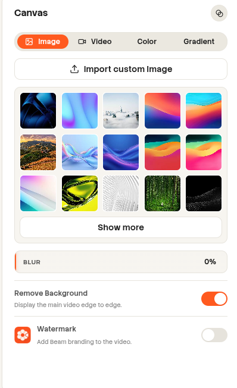

Technical details :
Interface is made via Electron and Vue framework.
Mediabunny is used for playback and export of the video.
Canvas2D API is used to composite layers.

Category : Clip

Each Video/Image/Text/Camera is considered a clip.
Properties shown in the Clip section will vary depending on your selection.

When you have no clip selected, the Clip section will be empty.
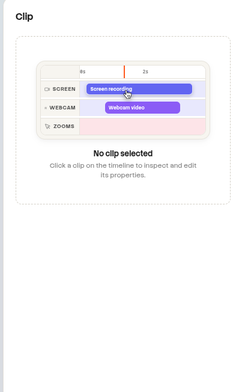

When you have a clip selected, the Clip section will show the properties of the clip. For example with a webcam clip here.
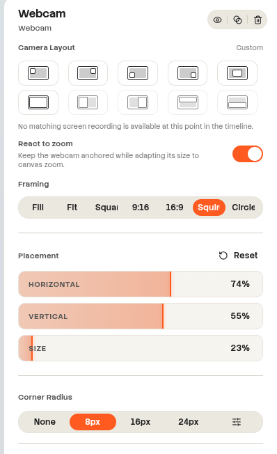

[TO THE AI] PLEASE ADD ALL THE PROPERTIES OF EACH CLIP BY LAUNCHING LUNA AGENTS TO FIND OUT WHAT PROPERTIES ARE AVAILABLE FOR EACH CLIP TYPE. AND WHERE.

Category : Zooms

Zooms are what makes Beam different from other video editors.
Zooms highlight the area of the video that you want to zoom into.

When you have no zoom selected, the Zoom section will be empty.
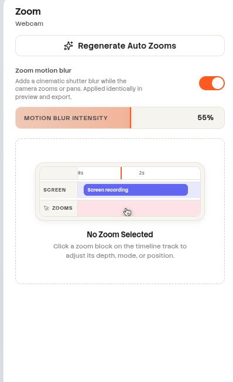

Select a zoom in the timeline to change it's parameters.
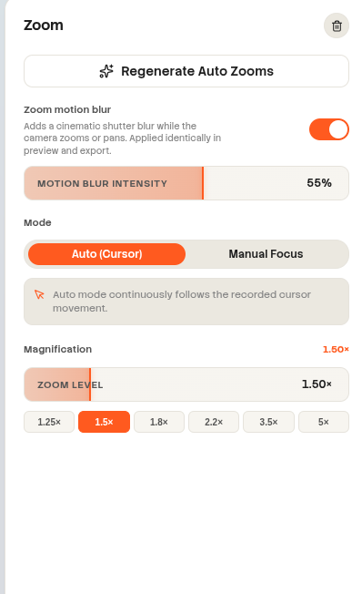

[TO THE AI] PLEASE ADD ALL THE PROPERTIES OF ZOOMS BY LAUNCHING LUNA AGENTS TO FIND OUT WHAT PROPERTIES ARE AVAILABLE FOR ZOOMS. AND WHERE.

Category : Cursors

Cursors is the cursor overlay showed on the video.

The default menu is shown below and does not require any selection.
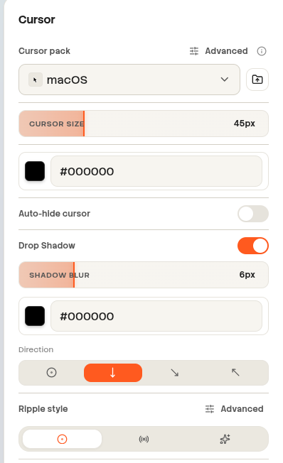

[TO THE AI] PLEASE ADD ALL THE PROPERTIES OF CURSORS BY LAUNCHING LUNA AGENTS TO FIND OUT WHAT PROPERTIES ARE AVAILABLE FOR CURSORS. AND WHERE.

Category : AI Captions

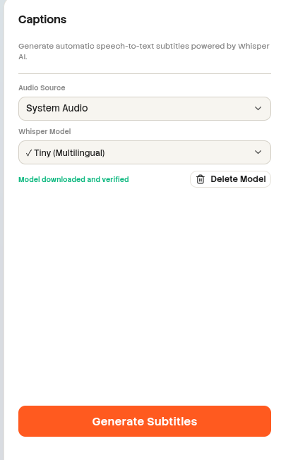

[TO THE AI] PLEASE ADD ALL THE PROPERTIES OF AI CAPTIONS BY LAUNCHING LUNA AGENTS TO FIND OUT WHAT PROPERTIES ARE AVAILABLE FOR AI CAPTIONS. AND WHERE.

Category : Audio

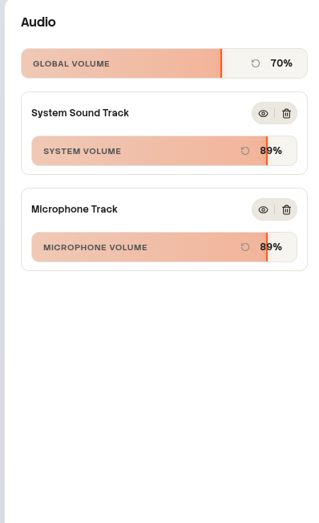

[TO THE AI] PLEASE ADD ALL THE PROPERTIES OF AUDIO BY LAUNCHING LUNA AGENTS TO FIND OUT WHAT PROPERTIES ARE AVAILABLE FOR AUDIO. AND WHERE.

Category : Settings

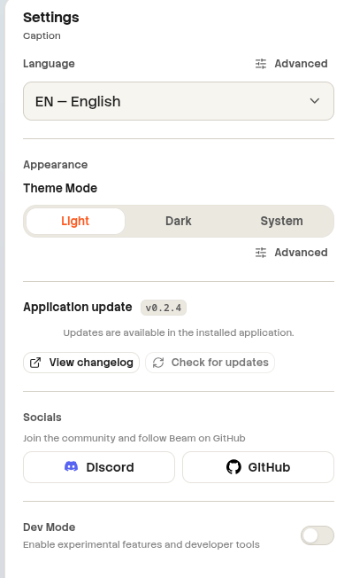

[TO THE AI] PLEASE ADD ALL THE PROPERTIES OF SETTINGS BY LAUNCHING LUNA AGENTS TO FIND OUT WHAT PROPERTIES ARE AVAILABLE FOR SETTINGS. AND WHERE.

Exports :

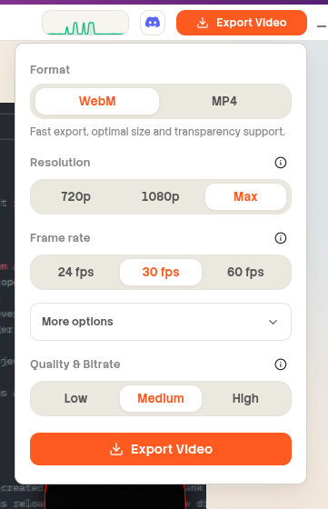

[TO THE AI] PLEASE ADD ALL THE PROPERTIES OF EXPORTS BY LAUNCHING LUNA AGENTS TO FIND OUT WHAT PROPERTIES ARE AVAILABLE FOR EXPORTS. AND WHERE.

TO THE AI, WHEN ADDING PROPERTIES ETC, INCLUDE SPECIAL EDGE CASES THAT MIGHT BE UNUSUAL OR NOT COMMON.
