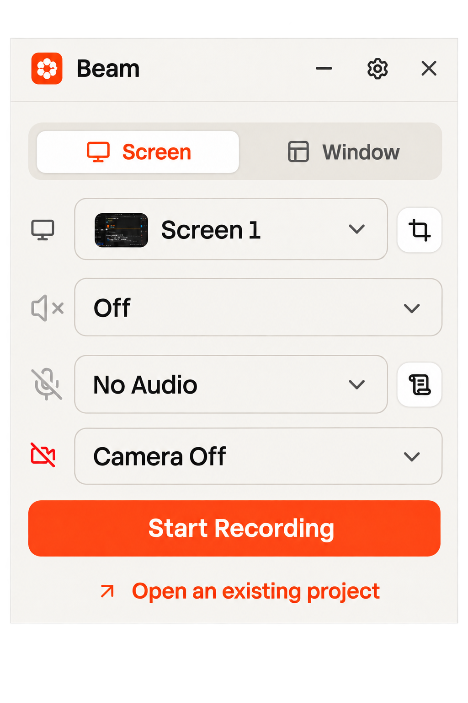
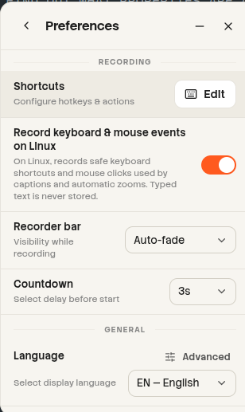

# Recorder app

The Recorder is the part of the app that lets you record your screen, system audio, webcam, and microphone.

To record with Beam, you have three options:

- Screen mode
- Window mode
- Crop region --> Records only what you want to show. It comes with presets for common use cases, or you can draw a custom crop region.

Screen mode records the entire screen, while Window mode records a specific window.
Both mode can be used to record audio and video. Adjust it to your needs.
!!NOTE!! for Linux users, Screen mode is recommend, as there is no way to hide Beam from the Screen recording.

System audio is the audio output of the system, including the sound of the computer's speakers. For example, watching a youtube video, or a talking to a friend on Discord.

Microphone is the audio input of the system, including the sound of the user's voice. For example, speaking into a microphone while using Beam.

Keep in mind, if you are using your laptop speakers, you may need to adjust your volume settings to avoid feedback. As both the system audio and microphone are recorded simultaneously, you may hear your own voice in the output.

To start a recording, click on the Start Recording button.
**macOS only**
On macOS Ventura and later, open System Settings > Privacy & Security and allow Beam separately under Microphone, Camera, and Screen & System Audio Recording.
On earlier macOS versions, open System Preferences > Security & Privacy and allow Beam under Microphone, Camera, and Screen Recording.

**Linux only**
On Linux, enable interaction recording in Beam Preferences to capture clicks and keyboard shortcuts. The DEB and RPM packages install the input helper and its Polkit rule through the package manager. AppImage asks for administrator authorization when its helper or rule needs to be installed or updated. Once installed, the matching helper can start in an active desktop session without another password prompt. Recorded interaction data is saved only during a recording; ordinary typed text is filtered out.

If access fails, Beam displays the helper's error rather than assuming you refused authorization. Retry from Preferences after addressing the reported problem. When reporting a failure, use **Copy system information**: the Linux section includes the distribution, desktop/session type, interaction error and detected device counts when available. Canceling the password dialog leaves access disabled and allows another attempt.

Teleprompter :
Next to the microphone selection box, you have a Teleprompter button that allows you to add a teleprompter when recording. This allows you to display a script that will automatically scroll through during your recording. It comes with a bunch of options (changing speed of scrolling, size of the text, spacing between lines, continuous scrolling or line by line scrolling)
You can find shortcuts related to the teleprompter in the Preferences --> Shortcuts window.

Preferences :
In the Topbar of the Recorder, you have a Cog icon that opens the Preferences window.
Preferences are stored in the user's home directory `/video/Beam/user/preferences.json`. It includes the management of Shortcuts, Theme, Language, Updates, amongst other settings.
For the case of the Recorder Preferences you have several options related to it :

- Change countdown timer (Default: 3 seconds) --> When starting a recording, it will count down from this value before starting the recording.
- Recorder bar visibility while recording : Always visible, Fade out until hovered, or Hidden until hovered.

Some preferences are shared between the Recorder and the next section "Video Editor".

Open an existing project :
Under the Start Recording button, you can open an existing project by clicking on the `Open an existing project` button.
This button takes you to the Project Manager, where you can select an existing project to open.
All of your projects are stored in the user's home directory `/video/Beam/user/projects/`.
They are given random names with a number suffix, when there is an overlap, such as : "Clever Comet", "Rapid Signal"...
The most recently opened project is automatically selected when you open the Project Manager.

A Project in Beam is a collection of Recordings (sessions). Basically in the future, a Project will be able to hold multiple Recordings, and will be able to manage them as a single unit.
For now, one Project is equivalent to one Recording. Each recording ends up being stored as a separate file in the user's home directory `/video/Beam/user/projects/`.

You have different options in this window, such as:

- Searching for a project name
- Selecting one or multiple projects, most notably for multi-deletion.
- Creating a new project (by clicking on the `New Project` button) --> A recording is not created, It is started as a Blank project.
- Refreshing the project list (by clicking on the `Refresh` button) --> The project list is reloaded from the user's home directory.

About the badges shown in the top left of each Project:
The badges indicate the different mediums used in the project.

- Monitor Icon --> Screen recording
- Caption Icon --> AI Captions or Text layer
- Camera Icon --> Webcam
- Mic Icon --> Microphone
- Speaker Icon --> System Audio

When you hover over a project, it will play the Screen Recording so you can preview what was going on in this clip.

Beam Recorder technical details :
Screen recording and System Audio is native to the OS
Microphone and Webcam are managed by Electron.
The code is available on Github, It is made in the programming Rust, for cross-platform compatibility, memory safety and performance.
The GUI interface is written with Electron, like most modern desktop applications (Discord, Slack, Teams...) for cross-platform integration.
